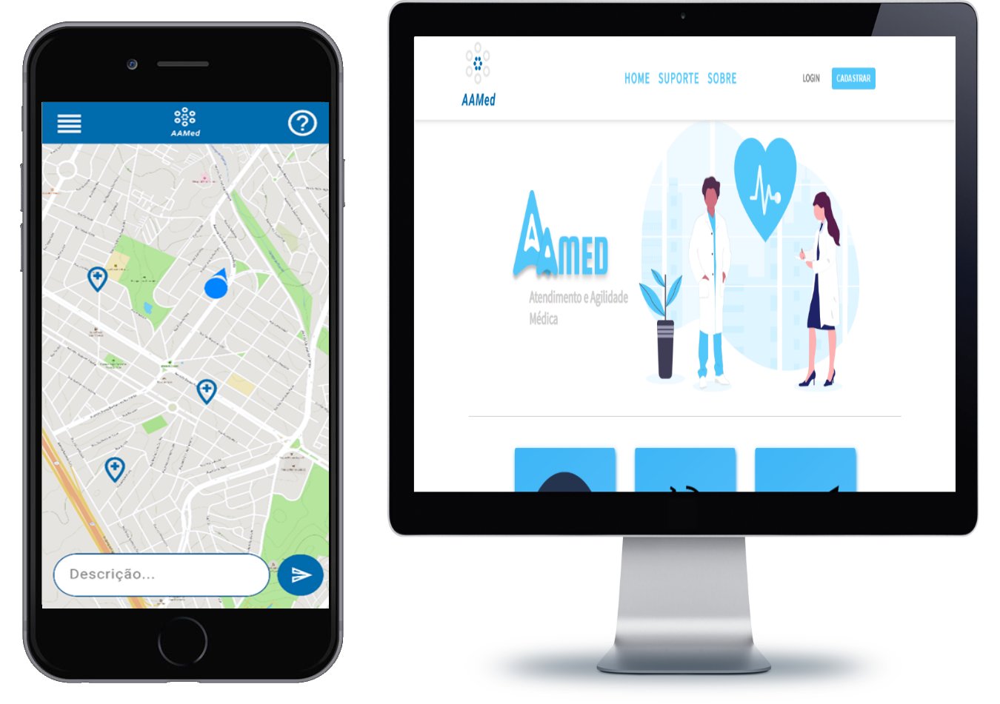

<h3 align="center">
    
</h3>

<h3 align="center">AAMED - Atendimento e Agilidade Médica</h3>

<div align="center"> 

  <a href="https://www.linkedin.com/in/vinicius-piantoni-328339186">
    
  </a>

  <a href="https://github.com/ViniPiantoni/atendimento-e-agilidade-medica-AAMed/blob/master/LICENSE">
    
  </a>

</div>

---

### 📺 Apresentação:

A <strong>AAMed( Atendimento e Agilidade Médica )</strong> é uma aplicação de conclusão final de curso com intuito em melhorar o precário sistema de saúde. Nossas plataformas <strong>web</strong> e <strong>mobile</strong> agilizam todo o processo de atendimento e gerenciamento dos hospitais, assim aplicando maior perfomance e rapidez ao paciente.

<h3 align="center">
    
</h3>

#### 📖 Quer ler toda a documentação do AAMed?

```sh
    # Copie e cole o link abaixo na url do seu navegador.
    https://drive.google.com/drive/folders/1jynmeeJ6NW_d5pvqd3iTFkesokCY0iLB?usp=sharing
```

---

### 💻 Tecnologias utilizadas

- [Node](https://nodejs.org/en/)
- [MongoDB](https://www.mongodb.com/)
- [React](https://pt-br.reactjs.org/)
- [React Native](https://reactnative.dev/)
- [Expo](https://expo.io)
- [HTML](https://developer.mozilla.org/pt-BR/docs/Web/HTML)
- [CSS](https://developer.mozilla.org/pt-BR/docs/Web/CSS)

---

### :fire: Instalação e inicialização

#### Pré-requisitos

- É <strong>necessário</strong> ter instalado o [Node.js](https://nodejs.org/en/) qualquer versão <strong>acima de 10</strong>.
- Instalar o [NPM](https://www.npmjs.com/get-npm) ou [YARN](https://classic.yarnpkg.com/pt-BR/docs/install/) (recomendamos o NPM).
- <strong>Não precisa </strong>instalar o banco de dados na máquina pois o mesmo está na nuvem.
- Instalar o [Expo](https://expo.io/learn) globalmente.
- <strong>Recomendamos</strong> instalar o editor [VSCode](https://code.visualstudio.com/download).
- Caso for rodar a aplicação mobile no <strong>dispositivo fisico</strong>, você irá precisar ter instalado o aplicativo do [Expo](https://play.google.com/store/apps/details?id=host.exp.exponent&hl=pt).

##### 1º :page_facing_up: Faça o clone no repositório:

```sh
    $ git clone https://github.com/ViniPiantoni/atendimento-e-agilidade-medica-AAMed.git
```

##### 2º :fast_forward: Instale as dependências usando NPM ou YARN e execute a aplicação:

- Iniciando o back-end

```sh
    # Pelo prompt de comando entre na pasta backend
    $ cd tcc/backend

    # Instale as dependências
    $ yarn install

    # Inicie o server
    $ yarn dev
```

- Iniciando a aplicação web

```sh
    # Pelo prompt de comando entre na pasta web
    $ cd tcc/web

    # Instale as dependências
    $ yarn install

    # Inicie a aplicação
    $ yarn start

    # Automaticamente será aberta uma janela no seu navegador padrão.
    # Caso isso não ocorra acesse: localhost:3000.
```

- Iniciando a aplicação mobile

Antes de iniciar a aplicação mobile é necessário que você adicione sua chave da [API](https://cloud.google.com/maps-platform/) do Google Maps. Vá na pasta <strong>mobile</strong> e em seguida no arquivo <strong>app.json</strong> e cole a chave.

```sh

    # Copie e cole o link abaixo na url do seu navegador para ter obter informações de como gerar a chave
    https://cloud.google.com/maps-platform/

    # Em seguida, cole a chave no local referenciado abaixo:
     "config": {
        "googleMaps": {
          "apiKey": "sua_chave_aqui"
        }
      }

```

```sh
    # Pelo prompt de comando entre na pasta mobile
    $ cd tcc/mobile

    # Instale as dependências
    $ yarn install

    # No arquivo index.js (pasta src -> screens -> Home) na linha 62 troque a string de conexão pelo seu endereço IP. Salve o aquivo.
    # No arquivo api.js (pasta src -> services) troque a baseURL pelo seu endereço IP. Salve o arquivo.

    # Inicie a aplicação
    $ yarn start

    # O Expo irá abrir no terminal e/ou no navegador.
    # Você precisa apenas escanear o QRcode com seu dispositivo fisico ou rodar a aplicação no seu emulador.
```

---

### 👥 Como contribuir

- Faça um fork desse repositório
- Crie uma branch com a sua feature: `git checkout -b my-feature`
- Commit suas mudanças: `git commit -m 'feat: My new feature'`
- Faça um push para sua branch: `git push origin my-feature`

---

### :raised_hand: Dependências

#### Backend

- aws-sdk
- axios
- bcryptjs
- cep-promise
- cookie-parser
- cors
- dotenv
- express
- jsonwebtoken
- mongoose
- morgan
- nodemailer
- nodemon
- socket.io

#### Web

- axios
- cep-promise
- cpf-cnpj-validator
- jquery
- react-bootstrap
- react-dom
- react-router-dom
- react-scripts
- react-icons
- react-input-mask
- react-router-dom
- socket.io-client
- styled-components

#### Mobile

- axios
- expo
- expo-font
- expo-linear-gradient
- expo-location
- formik
- gerador-validador-cpf
- moment
- react-dom
- react-native-animatable
- react-native-maps
- react-native-maps-directio
- react-native-masked-text
- react-native-reanimated
- react-native-safe-area-context
- react-native-screen
- react-native-vector-icons
- toggle-switch-react-native
- socket.io-client
- styled-components

---

### :lock: Licença

Esse projeto está sob a licença MIT. Veja o arquivo [LICENSE](LICENSE) para mais detalhes.
